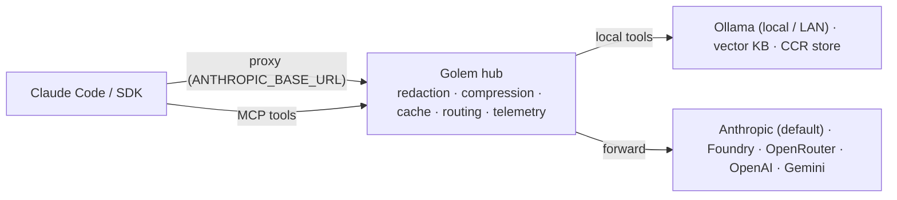
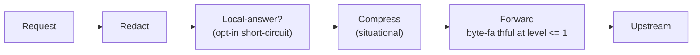

# Golem — a universal pre-LLM processing layer

**[golem.run](https://golem.run)** · npm `golem-run` · CLI `golem`

Local-first **TypeScript** proxy + unified MCP server that sits in front of
your LLM traffic and handles what shouldn't have to hit a model provider
first: **redaction** (secrets/PII stripped before anything leaves the
machine), **local tools** (vector knowledge base, tiered Ollama inference, CCR
expansion), **routing** (Claude, with Foundry/OpenRouter adapters extending
the same pipeline), and **honest observability** (real billed-token telemetry,
not estimates). Compression (Golem-native lossless stage; optional
[Headroom](https://github.com/headroomlabs-ai/headroom) Python sidecar for
ML-heavy stages) is part of the pipeline too, but it's *situational* — it pays
off on non-caching upstreams, not on Anthropic's cached traffic, where the
honest number today is ~0% (see `docs/plan/verification-notes.md` §54).

Claude Code is Golem's flagship, most-verified integration — byte-faithful
proxying, native MCP tools, `/golem/*` skills — with the same pipeline
designed to extend to other gateways. Native Windows, macOS, and Linux.

## How it works

One local process exposes two doors — a **transparent proxy** (every request) and an
**MCP server** (explicit tools) — over one shared engine, and talks to local models
(Ollama, on this box or a LAN GPU box), a vector knowledge base, and the upstream
LLM:



Every `POST /v1/messages` runs a fixed pipeline — **redaction always first** (never
reordered), then situational compression, then a byte-faithful forward at
compression level ≤ 1:



Full component diagrams — request lifecycle by compression level, web-fetch caching,
search/RAG/vector DB, local/LAN/upstream routing, observability, and the guardrail
stack — are in the wiki: **[docs/wiki/concepts/Architecture.md](docs/wiki/concepts/Architecture.md)**.

## Install

```sh
# macOS / Linux
curl -fsSL https://golem.run | sh

# Windows (PowerShell)
irm https://golem.run | iex
```

The installer is npm-first: it uses `npm i -g golem-run` when Node ≥ 22 is
present, and falls back to a self-contained binary (no Node needed) otherwise
(spec Decision 41). Then run `golem init` in your project. Already have Node?
`npm i -g golem-run` works directly. Keep current with `golem update` (the VS
Code extension also surfaces an update prompt). Release process: [RELEASING.md](RELEASING.md).

## Settings

Run **`golem`** in a terminal — that's it, no subcommand — for an interactive control panel:
live status in the header, then every setting, guidance rule, and runtime control
as a toggle or picker — each showing which layer supplied its value, writable at
**project**, **local**, or **user** scope.

```
 ■▜▛▜▆▛▜▙   Golem <version> · ~/code/my-project
 ▝▜██▀███   Proxy ● http://localhost:4653   Level 1 lossless   Upstream anthropic
 ▚▟█▛▚█▛▘   Local ● qwen2.5-coder:7b   Limits 5h 20% used
────────────────────────────────────────────────────────────────────────────────
   SETTINGS    Guidance    Runtime                                scope: project
────────────────────────────────────────────────────────────────────────────────
 Knowledge — Vector search, the wiki, local answers, and the web cache
 ▸ [x] Vector knowledge base              on                    default
   [x] Answer locally from the wiki       on                    default
   [ ] Rerank search hits locally         off                   default
────────────────────────────────────────────────────────────────────────────────
 ↑↓ move · space toggle · enter edit · s scope · tab group · ? help · q quit
```

`space` toggles, `enter` edits a value (empty = unset), `s` cycles the write
scope, `tab` switches group, `a` reveals advanced settings. Rows set by a
`GOLEM_*` environment variable are locked, since env beats every file layer.

Flags: `golem --dir <path>` opens it for another project, `--no-pet` hides the
mascot, `--advanced` starts with advanced settings shown.

It opens in about **170ms** — the panel renders itself with no UI framework, and the
CLI's hot paths are kept deliberately thin (`golem hook post-tool-use`, which Claude
Code runs on every tool call, is ~126ms). See
[Configuration Surfaces](docs/wiki/concepts/Configuration%20Surfaces.md).

The same controls are available non-interactively (`golem config list|get|set|unset`,
`golem guidance`, `golem compression`, `golem brevity`) and in the VS Code panel's
Settings section — all three render from one surface, `golem config schema --json`.

- **Spec:** [docs/golem-spec.md](docs/golem-spec.md) (source of truth)
- **Plan:** [docs/plan/IMPLEMENTATION_PLAN.md](docs/plan/IMPLEMENTATION_PLAN.md) · [docs/plan/ROADMAP.md](docs/plan/ROADMAP.md)
- **Live-doc findings:** [docs/plan/verification-notes.md](docs/plan/verification-notes.md)
- **Agent guidance:** [CLAUDE.md](CLAUDE.md)
- **Project wiki:** [docs/wiki/](docs/wiki/) (knowledge base — see [WIKI.md](docs/wiki/WIKI.md))

## Development

Node ≥ 22.

```sh
npm ci
npm run check   # lint (Biome) + typecheck (tsc --strict) + tests (vitest)
```

Interfaces in `src/interfaces/` are frozen contracts — see CLAUDE.md before
changing anything there.
