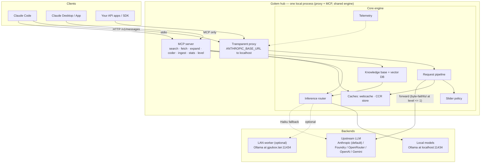
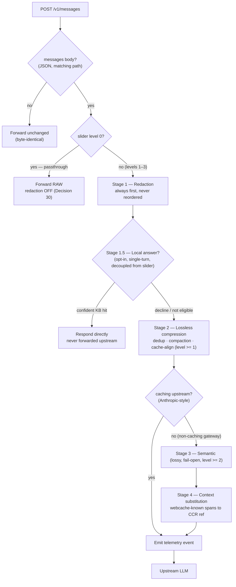
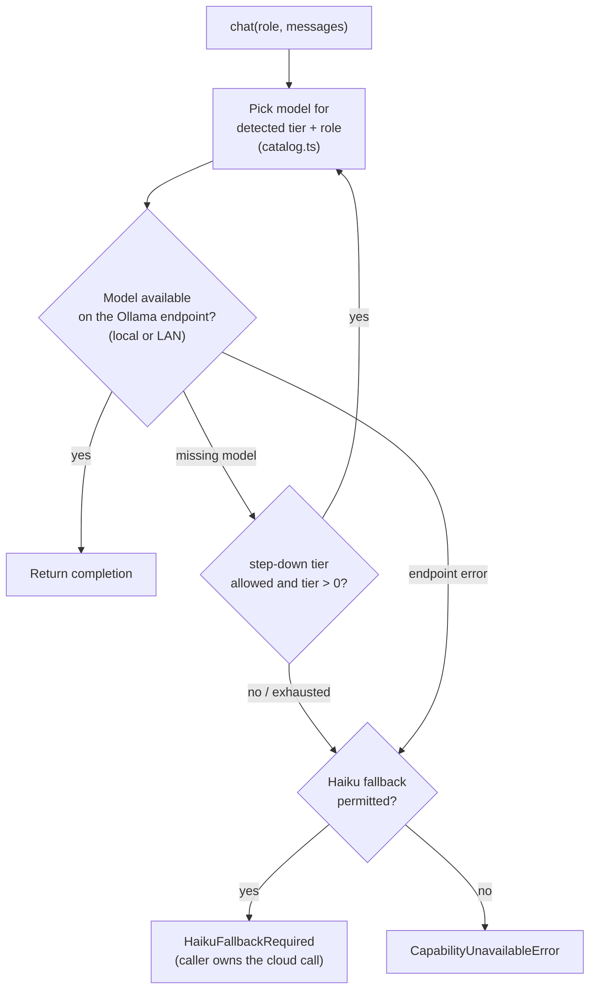
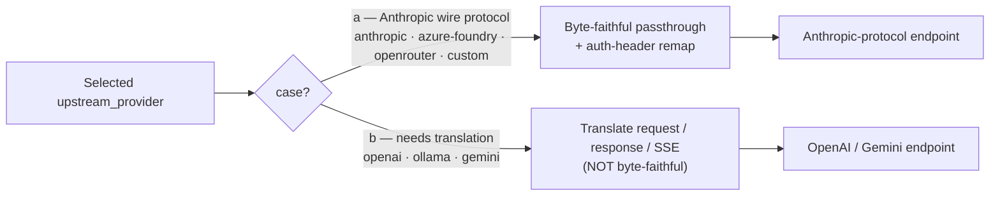
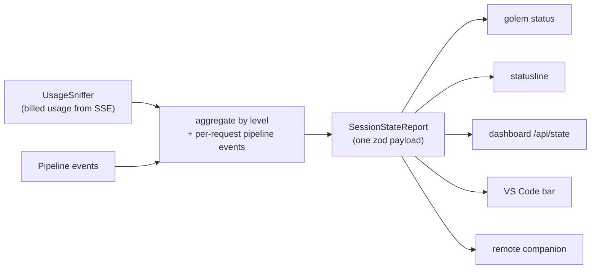
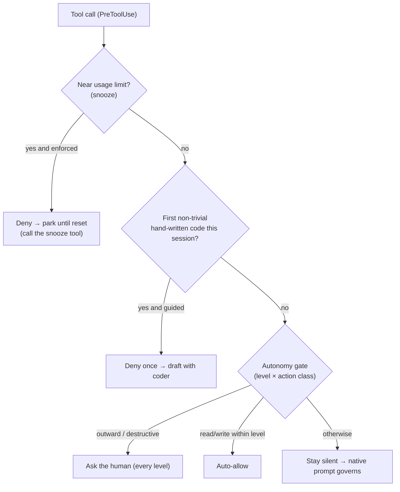
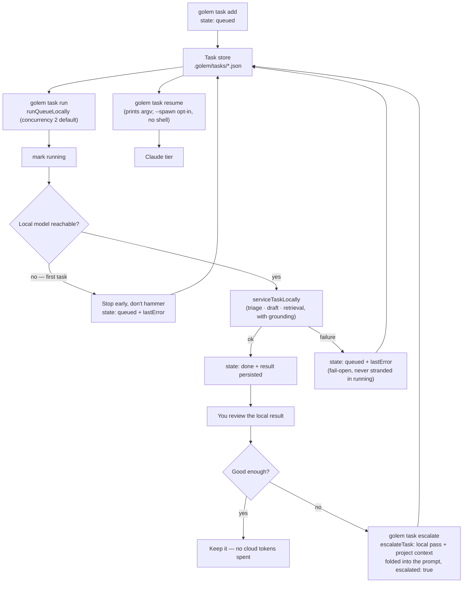
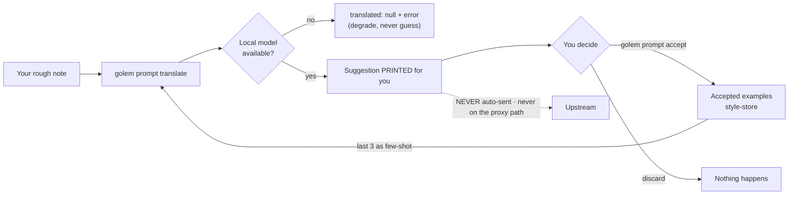

# Architecture

The visual map of how Golem is put together and how a request moves through it.
This page is the **deep-dive entry point**: each diagram is captioned with the
`src/…` file(s) it reflects so you can jump straight from picture to code. Where the
spec and the shipped code differ, the diagrams follow the **code** and say so.

Diagrams are [Mermaid](https://mermaid.js.org) — plain text that renders on GitHub,
in the VS Code preview, and in Obsidian, and diffs in git like the rest of the wiki.

Related pages: [[Slider Levels]] · [[Redaction Stage]] · [[Compression]] ·
[[Web Cache]] · [[Knowledge Base]] · [[Distillation Pipeline]] ·
[[Wiki-First Knowledge]] · [[Guidance Rules]].

---

## 1. Component topology

One local process exposes **two doors** (a transparent proxy and an MCP server) over
**one shared engine**, and talks to three classes of backend: local models, an
optional LAN worker, and the upstream LLM. Single-machine is the default; the LAN
worker is optional (spec §2). Source: `docs/golem-spec.md §2`, `src/proxy/`,
`src/mcp/server.ts`, `src/inference/`.

> **The two doors compose.** The proxy sees *every* request and does *implicit*
> savings (redaction, dedup, caching); MCP is *explicit* delegation (Claude chooses
> to `search` 5 chunks instead of reading 50 files). Claude Desktop cannot repoint
> its base URL, so it gets MCP-only — acceptable, since token pain concentrates in
> agentic proxy traffic (spec §2.1).

---

## 2. Proxy request lifecycle

Every `POST /v1/messages` runs the pipeline in `src/pipeline/pipeline.ts`. **Stage
order is a hard rule: redaction runs first and is never reordered after
compression.** The lossy stages (semantic, context-substitution) are gated OFF on
Anthropic-style caching upstreams so the byte-identical cached prefix survives — see
[[Compression]] and [[Slider Levels]].

Notes that keep this honest (all from `pipeline.ts`): a request where **no stage
changed anything** is returned as the original bytes; the local-answer stage
**fails open** (a retrieval/embedder error falls through to the upstream, never
errors the request); and levels ≥ 2 only *do* anything against non-caching gateways.

---

## 3. Backend routing

Golem routes to three backends. **Local vs LAN is pure configuration** — the same
Ollama-compatible protocol, differing only by `inference.ollama_base_url`
(`localhost` vs a lab box like `gpubox.lan:11434`, spec §2.2). **Upstream** is the
selected provider.

### 3a. Local inference — role → tier → model, with graceful degradation

Source: `src/inference/service.ts`, `src/inference/catalog.ts`. Each role
(summarizer, extractor, classifier, drafter, judge) maps to a concrete quantized
model for the machine's detected hardware tier; a missing model steps **down** a
tier before giving up, and only then optionally signals a Claude Haiku fallback.

### 3b. Upstream provider — byte-faithful vs translating

Source: `src/providers/index.ts`. Anthropic-wire providers stay **byte-faithful**
(only the auth header is remapped: strip the client's Anthropic key, inject the
configured upstream key). OpenAI/Gemini/Ollama need genuine request/response/SSE
**translation** and are a separate, non-byte-faithful code path.

> Switching upstream account/provider is `golem account use <id>` + a proxy restart,
> **not** the Claude Code model picker.

---

## 4. Observability — one state source, thin renderers

Golem emits a single `SessionStateReport` (one zod payload) that every surface
renders — so the terminal, dashboard, and VS Code can never diverge (spec §5, R5.2).
Billed usage is read from the real SSE stream, not estimated. Source:
`src/proxy/usage-sniffer.ts`, `src/telemetry/`, `src/hooks/session-state.ts`.

---

## 5. PreToolUse guardrail stack

Three independently-toggleable gates run on Claude Code tool calls, all **fail-safe**
(default-deny / defer to the human on anything outward or destructive). Source:
`src/mcp/snooze.ts` (see `.claude/rules/golem-snooze-hold.md`),
`src/hooks/coder-first-nudge.ts`, `src/autonomy/gate.ts` (matrix + proofs in
`docs/decisions/ADR-0002`). See also [[Guidance Rules]].

---

## 6. Task multiplexing and prompt translation — the two explicit local paths

Two features route work to the local model **outside** the request pipeline. Both
are engaged only by an explicit act — the compression dial never triggers either
(Decision 31) — and both are drawn together here because they are the places
people most often assume automation that does not exist.

### 6a. Durable tasks serviced locally, escalated explicitly

A queued task (R5.1, one zod JSON per task under `<project>/.golem/tasks/`) is
serviced on the Ollama tier by `golem task run`, bounded so it respects the
machine. A local result is never silently promoted: folding it into the prompt as
grounding and handing the task to the Claude tier is a separate command.
Source: `src/tasks/multiplex.ts`, `src/tasks/types.ts`.

The dogfooding origin is spec 20a: in-flight work was repeatedly lost to session
limits, so a task is a **checkpoint**, not a job — an interruption re-queues it.
`blocked` waits on a human, `paused` is capacity-gated, and `done`/`failed`/
`cancelled` never auto-resume. Parking a live session at the limit is a different
mechanism (see §5 and `.claude/rules/golem-snooze-hold.md`).

### 6b. Prompt translation — shown, never sent

`golem prompt translate` rewrites a rough note into a clearer prompt using the
local model, few-shot-grounded in the user's own previously *accepted* rewrites.
It sits entirely off the proxy path: the suggestion is printed for inspection and
nothing is forwarded anywhere. A spike, demand-gated (R5.5).
Source: `src/prompt/translate.ts`, `src/prompt/style-store.ts`.

Intent preservation is the non-negotiable constraint: the system prompt forbids
adding requirements the note didn't state, and because the output is only ever a
printed suggestion, a bad rewrite costs a glance rather than a wrong request.

---

## Where to go next

- The compression dial and per-level stage gating: [[Slider Levels]].
- Why higher levels give ~0% honest savings on cached Anthropic traffic:
  [[Compression]].
- The redaction floor and its one exception: [[Redaction Stage]].
- How WebFetch is cached and served without a round-trip: [[Web Cache]].
- Search / RAG / vector DB internals: [[Knowledge Base]].
- Turning raw capture into durable pages: [[Distillation Pipeline]].
