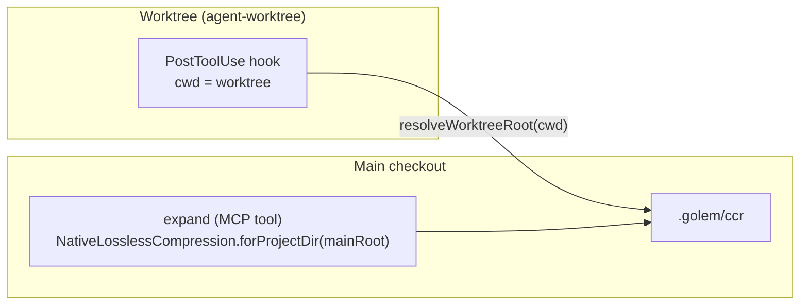

# CCR Ref Scope

[[Compression|CCR]] stores each original under `<projectRoot>/.golem/ccr`, keyed by
the ref's sha256. That root is decided per call, and a git **linked worktree** — a
second working directory sharing one repository, e.g. a Task-tool subagent under
`isolation: "worktree"` — is a DIFFERENT directory from its main checkout. Before
2026-08-22 the `PostToolUse` hook rooted a write on its own `cwd` while `expand`
was served by whichever `NativeLosslessCompression` the MCP server was built
with (the main checkout) — same refId, two different `.golem/ccr` directories, so
a ref the hook had just written read back as unknown minutes later. The digest
marker says "stored losslessly"; it was, just not where the reader looked.

## The decision: a worktree IS the same project

Golem treats a git worktree as the **same project** as its main checkout for CCR
purposes — refs are shared, and an agent working in a worktree writes to the
exact root `expand`'s main-session compression service reads from. The
alternative (worktree = a separate scope) would require the marker to stop
promising retrievability across roots and the MCP server to be told which root
it's answering for — a bigger, unrequested change, and one that breaks the
mental model `.claude/rules/golem-ccr-refs.md` already sets: "nothing is lost."

This is the identical call [[Knowledge Base|the vector index]] already made:
`canonicalProjectId` (`src/knowledge/file-driver.ts`) collapses a project id to
one canonical identity so the same directory never spawns two collections.
**Both routes now resolve through one shared function** —
`src/shared/git-worktree.ts#resolveWorktreeRoot` — so the CCR store and the
vector index cannot independently drift into disagreeing about what "the same
project" means. `resolveWorktreeRoot` is pure and synchronous: it reads the
git bookkeeping directly (a worktree's `.git` is a FILE holding
`gitdir: <main>/.git/worktrees/<name>`, and that directory's `commondir` file
holds the path back to the shared `.git`) rather than spawning `git`, so callers
that were already synchronous — `NativeLosslessCompression.forProjectDir` and
`canonicalProjectId`, both called inline at several sites — stayed that way.
Anything that doesn't match that exact shape (no `.git`, `.git` already a
directory, a malformed or missing pointer) resolves to the input unchanged: a
plain non-repo project is unaffected.

## `UnknownRefError` now names what it checked

Before, one `UnknownRefError("unknown CCR ref: <id>")` covered *never stored*,
*stored under a different root*, and *a corrupt envelope* — and the MCP error
text said "Unknown or **expired**", implying a retention policy that does not
exist. Grepping `CcrStore` and `LocalDirBlobStore` for
`prune|evict|ttl|maxEntries` turns up nothing: neither class prunes, ever.

`UnknownRefError` (`src/interfaces/compression.ts`) now carries `location` (where
the store looked — a filesystem path, or a plain description for a backend with
no single location) and `reason: "not-found" | "corrupt"`:

- **not-found** — nothing was stored under this refId at `location`: either it
  was never stored, or it was stored under a **different project root** (the bug
  this page describes). A store cannot tell those two apart from the outside, so
  both get this reason.
- **corrupt** — an envelope exists at `location` but failed to parse (invalid
  JSON) or failed schema validation; `detail` says which.

"No envelope for CCR ref `<id>` at `<path>`" is actionable — a reader can go look
at that path, or recognize the root is wrong. "Unknown or expired" was not.

## Out of scope (deliberately)

This page documents an **identity** decision, not a retention one: adding
eviction or a TTL to the CCR store is a separate, unopened discussion about disk
usage. The marker format (`hash=<64-hex>`) and redaction behaviour are also
unchanged.

See also [[Compression]] (CCR reference lifecycle), [[Knowledge Base]]
(`canonicalProjectId`, the sibling identity fix), [[Change Ledger]] (the other
place a git worktree's on-disk shape matters to Golem), and
[[Wiki-First Knowledge]].
