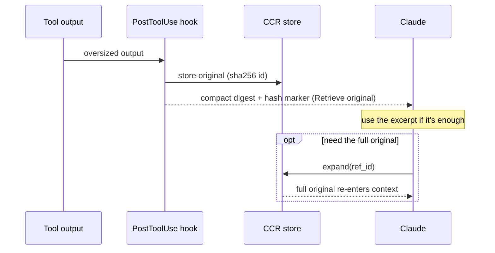

# Compression

Compression is one of Golem's pipeline stages, and its honest value is
**situational** (Decision 23): whether it saves tokens depends entirely on the
upstream, not on the slider setting.

- **Lossless compression + CCR** (dedup, compaction, cache-alignment, and
  content-reference swaps) runs from slider level 1 and is byte-faithful — the
  model sees the same content, just packed. See [[Slider Levels]].
- **Lossy semantic compression** (stale-turn drop, low-relevance pruning) is added
  at levels 2–3. This is where real token savings come from — but **only on
  non-caching upstreams.**

## Why savings are ~0% on Anthropic today

Anthropic's prompt caching already amortizes a stable prefix across turns, so
rewriting that prefix (what semantic compression does) mostly *breaks the cache*
rather than saving money — the net honest savings on Anthropic's cached traffic is
near zero. Golem measures this rather than asserting it (the net-of-cache A/B
infra, R1/R2). The stages that pay are gated to engage only on non-caching
upstreams, and the same pipeline is designed to extend to those gateways (Foundry,
OpenRouter — on hold per Decision 36). This is why the project positions itself as
a universal pre-LLM processor (Decision 32) with compression as *one* situational
lever, not the headline.

The lossless/CCR half is always worthwhile (it never breaks the cache); the lossy
half is the situational part. Implementation lives in `src/compression/`
(`native-lossless.ts` for the always-on lossless path, `headroom-adapter.ts` for
the pinned Headroom semantic stage).

## CCR reference lifecycle

**CCR** (content-reference) is the reversible half: an oversized tool output (or web
page, see [[Web Cache]]) is stored losslessly under `.golem/ccr` and replaced with a
compact digest carrying a `hash=<id>` marker. Nothing is lost — Claude re-hydrates
the original in one step with the `expand` MCP tool only when the excerpt isn't
enough.

See also [[Slider Levels]], [[Redaction Stage]], [[Architecture]], and
[[Wiki-First Knowledge]].
