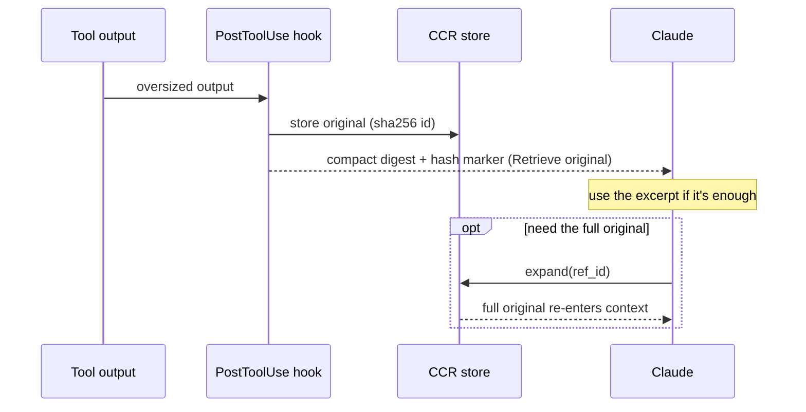

# Compression

Compression is one of Golem's pipeline stages, and its honest value is
**situational** (Decision 23): whether it saves tokens depends entirely on the
upstream, not on the dial setting.

- **Lossless compression + CCR** (dedup, compaction, cache-alignment, and
  content-reference swaps) runs from compression level 1 and is byte-faithful — the
  model sees the same content, just packed. See [[Compression Levels]].
- **Lossy semantic compression** (stale-turn drop, low-relevance pruning) is added
  at levels 2–3. This is where real token savings come from — but **only on
  non-caching upstreams.**

## Why the lossy stage is NET-NEGATIVE on Anthropic — measured, not assumed

Anthropic's prompt caching already amortizes a stable prefix across turns, so
rewriting that prefix (what semantic compression does) *breaks the cache* instead of
saving money. This was long described here as "~0% savings". **It is worse than
that**, and as of 2026-07-31 it is measured rather than asserted
(verification-notes §103, `scripts/measure_headroom_cache.py`):

- The lossy stage's **gross** reduction is real — **7.08%** on a 1,404-message
  session, **21.69%** on a 4,631-message one, growing with session length.
- But it first diverges from the original history at **message 6 of 4,631**, leaving
  **0.01%** of the history cache-readable. Headroom's `read_lifecycle` earns its
  savings by dropping the *earliest superseded* copy of a re-read file, so its value
  and its cache damage are the same act — not a tuning problem.
- Priced against this project's **98.4%** billed hit rate: **8.7×–11.3× more
  expensive** than not compressing. On a non-caching upstream the same runs save
  **9.06% / 30.09%**.

The takeaway for any future compressor: the number that decides it is
**first-divergence index**, not gross tokens. Something that rewrites only the
*tail* of history could pass where this fails. The stages that pay are gated to engage only on non-caching
upstreams, and the same pipeline is designed to extend to those gateways (Foundry,
OpenRouter — on hold per Decision 36). This is why the project positions itself as
a universal pre-LLM processor (Decision 32) with compression as *one* situational
lever, not the headline.

The lossless/CCR half is always worthwhile (it never breaks the cache); the lossy
half is the situational part. Implementation lives in `src/compression/`
(`native-lossless.ts` for the always-on lossless path, `headroom-adapter.ts` for
the pinned Headroom semantic stage).

## CCR reference lifecycle

**CCR** (content-reference) is the reversible half: an oversized tool output (or web
page, see [[Web Cache]]) is stored losslessly under `.golem/ccr` and replaced with a
compact digest carrying a `hash=<id>` marker. Nothing is lost — Claude re-hydrates
the original in one step with the `expand` MCP tool only when the excerpt isn't
enough. `.golem/ccr` is rooted per PROJECT, not per directory — see
[[CCR Ref Scope]] for how a git worktree resolves to its main checkout's root so
a ref survives across the two.

See also [[Compression Levels]], [[Redaction Stage]], [[Architecture]], and
[[Wiki-First Knowledge]].
