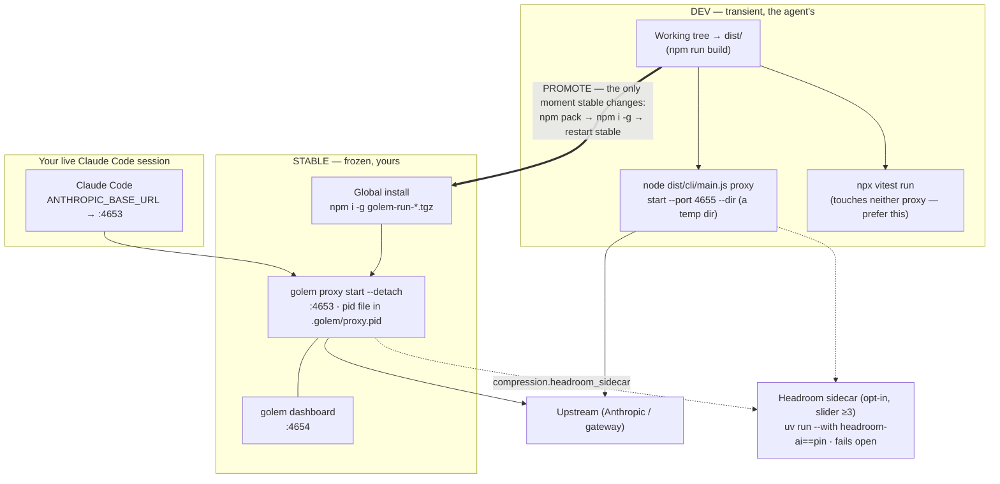

# Developing Golem while using Golem

Dogfooding Golem means the proxy that carries your Claude Code traffic is the
same software you're changing. To avoid a dev bug or a rebuild breaking your
live session, run **two proxies**: a frozen **stable** one you actually use, and
a throwaway **dev** one you test against. (The stable proxy runs the full
pipeline including the [[Redaction Stage]]; see also [[Wiki-First Knowledge]]
for how sessions find project knowledge.)

## The split at a glance

Two proxies, two ports, and exactly one deliberate moment where the live one
changes. Everything in **STABLE** is frozen; everything in **DEV** churns with
every `npm run build`.



Why it holds: stable is a *real copy*, not a symlink into the repo, so a broken
`dist/` or a crashed dev proxy cannot reach `:4653`. Promotion is an explicit
three-command act, never a side effect of a build.

## The split

| | Stable | Dev |
|---|---|---|
| Build | frozen global install (`npm i -g golem-run-*.tgz`) — a real copy, unaffected by `npm run build` | the repo's `dist/` (changes every build) |
| Run | `golem proxy` (resolves to the global binary) | `node dist/cli/main.js proxy --port 4655` |
| Port | **4653** (what `golem init` writes to `ANTHROPIC_BASE_URL`) | **4655** (never in your session's path) |
| Who runs it | **you**, in your own terminal (persists across agent sessions) | the agent, transiently, only while testing |
| Dashboard | `golem dashboard` → 4654 | — |

Your Claude Code session's `ANTHROPIC_BASE_URL` points only ever at **4653**.
Because stable is a frozen copy, rebuilding the repo — or a crash in dev code —
cannot affect it.

## Running stable persistently

The proxy has a daemon lifecycle, so it survives on its own — no dedicated
terminal needed. A `--detach`'d proxy outlives the shell that started it (that
was the old failure mode: an agent-started background job dying with its
session).

```sh
golem proxy start --detach     # binds 4653, backgrounded, survives this shell
golem proxy status             # running? which pid/port/upstream?
golem proxy restart            # reliable: stop, wait for the port, start detached
golem proxy stop               # stop it
golem dashboard                # savings UI on 4654 (still foreground)
```

`golem proxy` with no subcommand runs in the FOREGROUND (for a terminal you keep
open). `start --detach` / `restart` are the persistent, agent-safe path — the
pid file at `<project>/.golem/proxy.pid` makes them idempotent and stoppable
from any shell.

## Testing dev changes (agent workflow)

Never rebuild onto 4653. Test the working tree on 4655:

```sh
npm run build
node dist/cli/main.js proxy start --port 4655 --dir /tmp/somewhere   # transient
# drive traffic at 4655, verify, then Ctrl+C (or: golem proxy stop --dir /tmp/somewhere)
```

Unit/integration tests (`npx vitest run`) don't touch either running proxy —
prefer them; only use a live dev proxy for true end-to-end checks.

## Batch redeploy (close-out step 2)

At the end of a batch the *running* processes must be on the code that just
landed. CLAUDE.md makes this a numbered close-out step; the rule that keeps
getting broken is **ordering**:

- Redeploy **after the last source edit** — including after a `biome --write`
  autofix. A restart followed by another `npm run build` leaves a stale daemon.
- Restart **even if you already restarted mid-batch**. Mid-batch restarts are for
  testing; they are not the deploy.
- **Verify, don't assume:** `golem proxy status` should report a *new* pid, and
  one command that exercises the change should print the new behaviour
  (`golem bench cost`, `golem stats --context`, `golem status`). An unverified
  restart is not a deploy — this is the same "recompute, don't assume" rule the
  telemetry code follows.
- A live `golem mcp serve` connection is **reconnected by Claude Code**, not by
  the CLI — only needed when an MCP tool's name, schema, or behaviour changed,
  and the agent should say so explicitly.
- `vscode-extension` only needs `npm run deploy:local` + "Developer: Reload
  Window" when extension files changed.

Docs-only commits afterwards need no redeploy.

## Promoting dev → stable

When a change is committed, tested, and you want it in your live proxy:

```sh
npm run build
npm pack                      # -> golem-run-<version>.tgz
npm install -g ./golem-run-*.tgz
# restart your stable `golem proxy` terminal to pick up the new binary
```

That is the *only* moment your live proxy changes — deliberately, not as a side
effect of development.

## Headroom semantic sidecar (opt-in, slider ≥3)

At slider level ≥3 Golem can route the losslessly-compressed request through the
**Headroom** compression pipeline (spec Decision 23). It is **off by default** —
it adds a Python dependency — and **fails open** (if it can't start, the request
is forwarded with just the lossless stages).

Enable it and provide the runtime:

```sh
# 1) Make `uv` available (https://docs.astral.sh/uv) — the adapter launches the
#    pinned package with `uv run --with headroom-ai==<pin>` (no global install).
# 2) Turn it on in <project>/.golem/settings.json:
#    { "compression": { "headroom_sidecar": true } }   (or GOLEM_COMPRESSION_HEADROOM_SIDECAR=1)
# 3) Set the slider to 3+ and restart the proxy:
golem slider 3
golem proxy restart
```

Heuristic-only by design: the sidecar uses **bare `headroom-ai`** (no torch /
`[ml]`), so `read_lifecycle` (dropping stale re-reads) + structural compression do
the work. The ML/Kompress tier adds <1% on code traffic and is deliberately not
wired (verification-notes §35). The stage is **lossy** (superseded file copies are
elided) and its *net* savings against Anthropic's prompt cache are still being
validated (§34/§36) — treat published savings numbers as provisional until then.

The Python worker is `src/compression/headroom-worker.py`; the only TS file that
knows Headroom is `src/compression/headroom-adapter.ts` (CLAUDE.md rule).

## Escape hatch

Three of them, in increasing order of how far they take Golem out of the path
(spec Decision 56):

1. **`golem proxy stop`** — turns the *pipeline* off while keeping the port
   served by a redaction-only shim. Nothing to reload, and nothing edited: the
   wiring stays, so Claude Code never notices. Restore with
   `golem proxy start --detach`. In the VS Code panel this is the Stop button.
2. **`golem proxy unwire`** — removes `ANTHROPIC_BASE_URL` (and
   `ENABLE_TOOL_SEARCH`) from `.claude/settings.json` → straight back to the
   direct API. **Reload the window afterwards**: Claude Code does *not* hot-reload
   `env` (verification-notes §13/§112), which is exactly why `stop` no longer
   relies on this. `golem proxy wire` puts it back. In VS Code: *"Go direct
   (unwire Golem)"*. A base URL Golem does not own is left untouched.
3. **`golem proxy stop --hard`** — releases the port too. Only useful when you
   want the process gone; a still-wired Claude Code will fail to connect until it
   is unwired or the proxy restarts, and the command warns when that is the case.

Per-request: the proxy honors an `x-golem-bypass` header for pure passthrough —
note that this, like slider level 0, is a **full** bypass with redaction OFF (the
shim above keeps redaction on). The pipeline also fails open: an error forwards
the original request unchanged rather than breaking the session.
