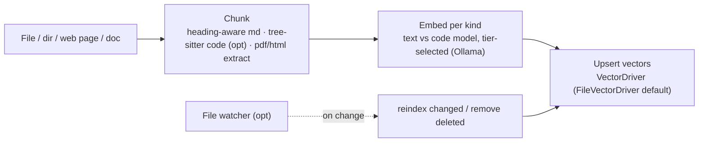
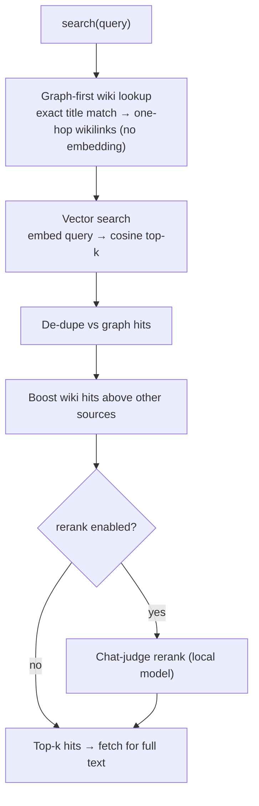

# Knowledge Base

Golem's local RAG layer: a per-project vector index over the documents you ingest
(codebases, docs, ADRs, fetched web pages), plus a **graph-first** lookup that lets
the committed [[Wiki-First Knowledge|wiki]] answer before similarity search ever
runs. Claude reaches it through the `search` / `fetch` / `ingest` MCP tools. Source:
`src/knowledge/knowledge-base.ts`, `src/mcp/server.ts`.

> **Code vs spec:** spec §3.1 targets Qdrant; the shipped default is an on-disk
> `FileVectorDriver` (`src/knowledge/file-driver.ts`) — no server process, zero
> install friction — behind the same `VectorDriver` seam a Qdrant driver can later
> implement. **One collection per project** (no cross-project bleed). Without a
> configured embedder, `ingest`/`search` degrade rather than crash. `canonicalProjectId`
> collapses a project id to one identity — Windows path-spelling variants, and (as
> of 2026-08-22) a git worktree resolving to its main checkout — see
> [[CCR Ref Scope]] for the sibling decision this agrees with.

## Ingest path (write)

A file, directory, fetched page, or ingested doc is chunked, each chunk embedded by
the tier-appropriate model, and the vectors upserted. An optional file watcher
incrementally re-indexes on change (ADR-0001).

## Search path (read) — graph-first, then vector

`assembleHits` (`src/mcp/server.ts`) is the one place hit assembly lives, shared by
the `search` tool and the `coder` tool's grounding. It tries a cheap, precise
**wiki title match** (and one hop along that page's `[[wikilinks]]`) with **no
embedding call**, then always runs vector search too, de-dupes, boosts wiki hits
above other sources, and optionally reranks with a local chat-judge.

Graph-first is **purely additive**: a free-text query that names no page just skips
straight to vector search, so nothing regresses. This is why keeping the wiki current
pays off directly — see [[Wiki-First Knowledge]].

## Scopes and federation

`search` can span more than the project index:

- **knowledge** (default) — the project's own vector index (code, docs, and pages
  fetched via [[Web Cache]]).
- **memory** (opt-in) — Headroom's conversational memory, via the optional Python
  sidecar (Decisions 13/18). Absent it, search silently degrades to knowledge-only.
- **user-scope wiki** — `~/.golem/wiki/` federated read-only across projects.

Hits from every active scope are merged, sorted by score, and truncated to *k*. Full
text for any hit comes back through `fetch` (`getChunk`), so Claude pulls ~2–5K
tokens of relevant chunks instead of reading whole directories.

See [[Architecture]] for how the KB sits beside the proxy and inference router, and
[[Distillation Pipeline]] for how raw captures become durable, linkable pages.
