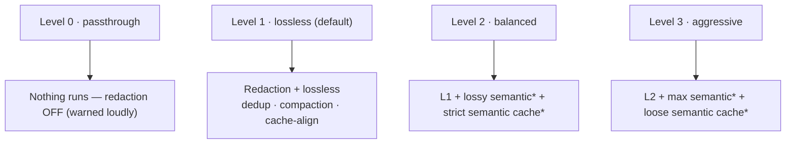

# Slider Levels

Golem's **slider** is a single global dial (0–3) that sets how aggressively the
pipeline compresses a request. It is *only* a compression-aggressiveness dial
(Decision 31): it never engages the local model — that happens solely via the
explicit `coder` MCP tool. The four levels (simplified from an older 0–5 scale by
Decision 30) map to per-stage switches in the frozen `SliderPolicy` contract
(`src/interfaces/policy.ts`, `LEVEL_TABLE`):

| Level | Name | What runs |
|---|---|---|
| **0** | `passthrough` | **Nothing — not even redaction.** A deliberate, byte-faithful full bypass. |
| **1** | `lossless` | Redaction + byte-faithful lossless dedup/compaction/cache-align. **Default.** |
| **2** | `balanced` | + lossy semantic compression (stale-turn drop) + strict semantic cache. |
| **3** | `aggressive` | + max semantic compression + loose semantic cache. |

Each level is additive — a higher level runs everything the lower one does, plus more.
The `*` stages are lossy and engage **only on non-caching upstreams** (see
[[Compression]]); on Anthropic's cached traffic they are gated off, so levels 2–3
behave like level 1. For how these stages sit in the full request path, see
[[Architecture]].

**Golem tells you when the level you set is not the level you get.** Because 2–3
collapse to 1 on a caching upstream, every surface that prints a level prints the
*effective* one — `golem status` (`level 3 (aggressive) → effectively 1 (lossless)`),
the status line (`⬢ Golem · Lossless … ⚠ 3 inert`), the `golem` panel header,
`golem slider <n>` at set time, and the `level` MCP tool. Setting 3 against
Anthropic is not an error and is not refused — the same setting is correct on a
non-caching account — it is just inert until you switch to one.

## Level 0 is the one place redaction is off

Redaction is mandatory and un-weakenable at **every level ≥ 1** — it always runs
first, before any content is transformed, stored, or forwarded (a CLAUDE.md hard
rule; see [[Redaction Stage]]). **Level 0 (`passthrough`) is the single deliberate
exception** (Decision 30, a USER decision): secrets/PII reach the upstream raw, so
it is a conscious opt-out equivalent to not using the proxy at all. It is never
the default and is surfaced loudly wherever active (`golem slider 0`, `status`,
the statusline, and the `level`/`slider`/`bypass` MCP surfaces all warn that
redaction is off).

## Levels 1–3 are byte-fidelity → savings trade-offs

Level 1 is byte-faithful (lossless only) and is the default. Levels 2–3 add lossy
semantic compression, which only pays on non-caching upstreams — see
[[Compression]].

**On cached traffic the cost of forcing them is not "no saving" — it is a large
loss.** Measured 2026-07-31 (verification-notes §103) on two real transcripts from
this repo: the lossy stage's *gross* reduction is genuinely 7–22% and grows with
session length, but it rewrites history from **message 6 of 4,631**, forfeiting a
prefix billed at a 98.4% cache-hit rate. Net effect: **8.7×–11.3× more expensive
than not compressing at all.** On a non-caching upstream the same runs save
9–30%. That asymmetry is the entire reason for the gate, and why
`compression.force_semantic_on_caching` should stay off. The exact per-stage config is the authoritative `LEVEL_TABLE` in
`src/interfaces/policy.ts`; this page is the conceptual summary, not a
duplicate of that table.

See also [[Compression]], [[Redaction Stage]], and [[Wiki-First Knowledge]].
