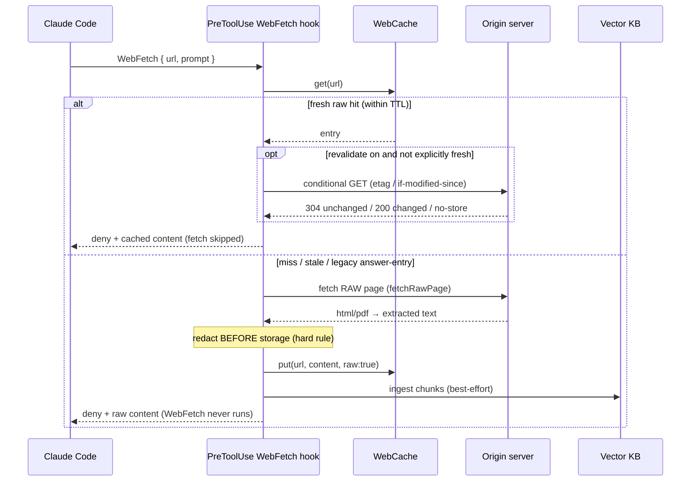
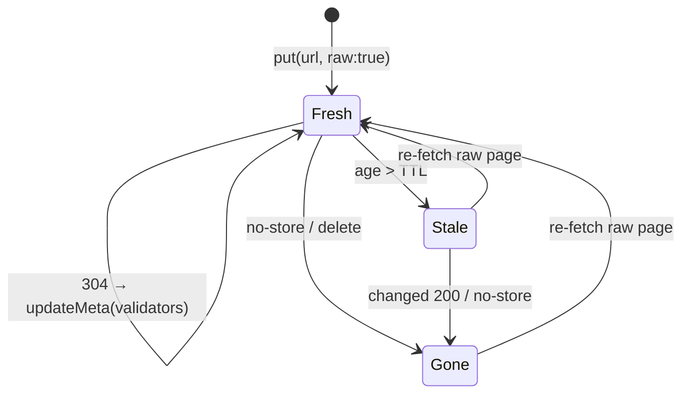

# Web Cache

How Golem serves a `WebFetch` from local cache instead of hitting the network — and
why the cached copy is the **raw page**, not `WebFetch`'s prompt-specific summary
(spec Decision 42). The cache is a tiny content-addressed store under
`<project>/.golem/webcache`, keyed by `sha256(url)`, that doubles as the freshness
clock over the same pages that get ingested into the vector [[Knowledge Base]].
Source: `src/hooks/web-fetch.ts`, `src/knowledge/web-cache.ts`.

## The fetch-cache-serve flow (PreToolUse)

On a `WebFetch`, a `PreToolUse` hook decides whether Golem answers from cache, or
fetches the raw page itself and serves that — so Claude Code's `WebFetch` never runs
on the happy path. Redaction runs **before** anything is stored (hard rule), and the
whole hook is **fail-open**: any error just lets `WebFetch` proceed.

- **Default TTL is 168h (7 days)** (`DEFAULT_WEB_CACHE_TTL_HOURS`); raw mode is on by
  default (`knowledge.webcache_fetch_raw`).
- **Oversized pages** (> ~8k chars served inline) are truncated for display but
  stored losslessly and handed back as a `hash=<id>` reference, retrievable in one
  step via the `expand` MCP tool — the same CCR mechanism described in
  [[Compression]].
- **PostToolUse** only matters in legacy (raw-mode-off) mode, where it caches
  `WebFetch`'s answer. In raw mode the pre-hook already owns caching, so the post
  hook deliberately caches nothing (storing a prompt-specific answer is exactly the
  bug Decision 42 fixes).

## Freshness lifecycle

An entry is *fresh* within its TTL (or an explicit `Cache-Control: max-age` /
`Expires`). Optional conditional revalidation can confirm-or-refresh it without
re-downloading the body; `no-store` or a changed `200` drops it.

## Where this sits

The web cache is the **exact-URL index + freshness clock**; semantic recall over the
same fetched pages is the [[Knowledge Base]]'s job (they are ingested there too). A
re-fetch of a known URL is therefore free and offline. See [[Architecture]] for how
this fits the whole request path, and [[Redaction Stage]] for the redaction floor
every storage path shares.
